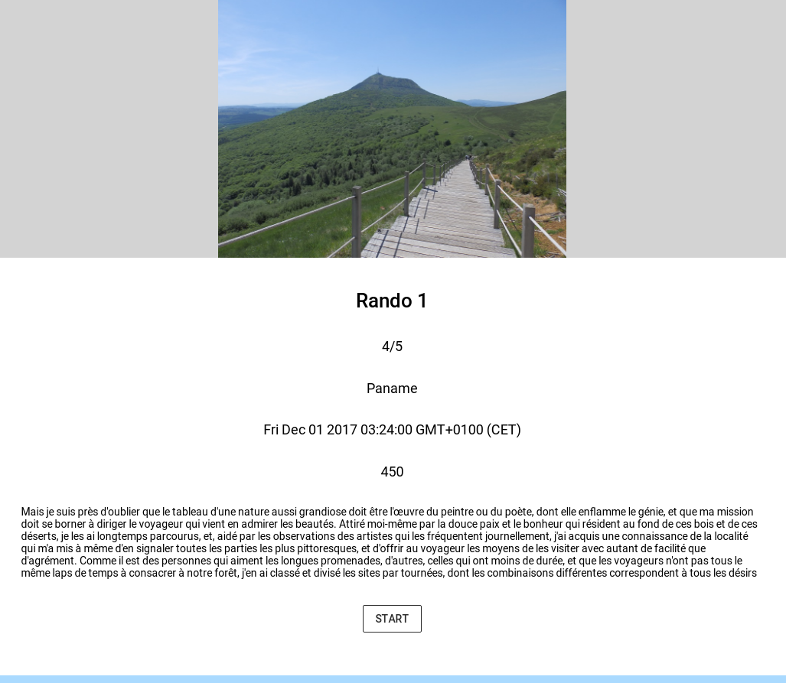

## Ionic App by SEVIK Ozcan & DE TAXIS DU POET Tanguy

## App to manage your hikings

### Commands to run the app

```
    npm install
    ionic serve
```

### Documentations useful are in folder /DOCUMENTATIONS
[Documentations](https://github.com/ozcansevik/ionic-app/blob/master/DOCUMENTATIONS/HIKING%20APP%20SEVIK%20DETAXIS.pdf)

### Features implemented

* Consultation des randonnées : page Master
* Vue avant de commencer la randonnée : page Detail Before
* Vue pendant la randonnée : page Detail During
* Ajout map agm-map avec marqueurs de toutes les étapes
* Utilisation de la geolocalisation
* Chronométrage de la durée de la radonnée
* Evolution des étapes selon la géolocalisation, avec confirmation de la part de l’utilisateur pour passer à l’étape suivante, indication visuelle des étapes atteintes
* Découpage en :
    - modules
    - pages
    - composants 
    - services
* Récupération de radonnées depuis data-gouv

### Additional features implemented 

* Utilisation de l’ionic storage, avec l’indexed db, pour stocker les hikings mais aussi utilisation du localstorage pour stocker la randonnée actuelle. Cela permet de trouver la radonnée sur laquelle on était meme si on ferme l’application, et de fonctionner également en hors-ligne (après une première synchronisation)
* Utilisation du lazy loading
* Possibilité de tracer des itinéraires reliant les étapes à l’aide de Google Maps ou bien avec des polylines

### Screenshot


